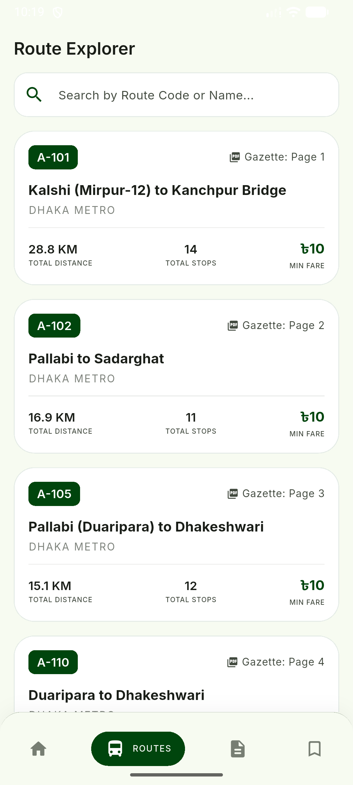
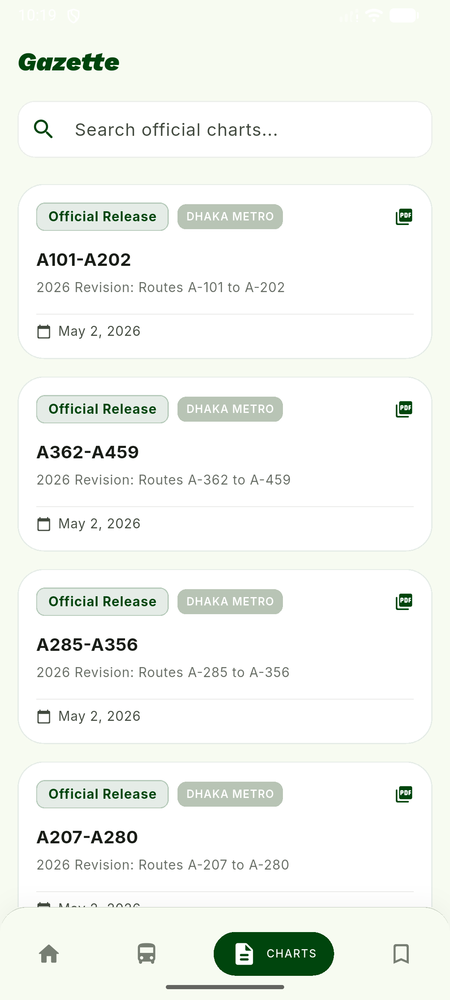
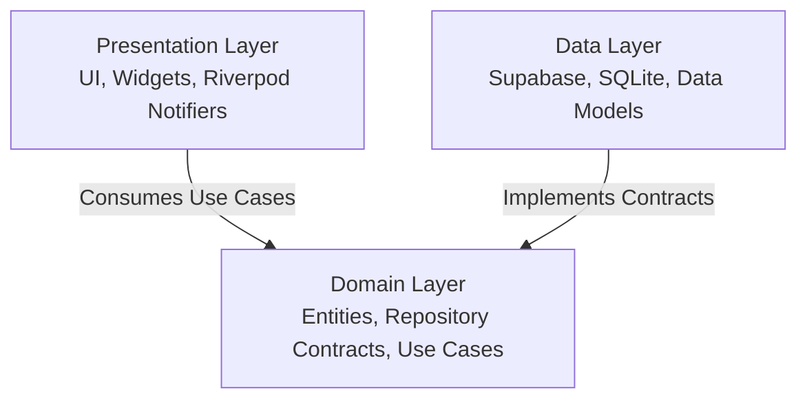

#  Jatayat (যাতায়াত)


**Jatayat** is a high-performance, local-first transit utility & fare calculator designed for commuters navigating urban transport systems in Dhaka and Chattogram. Built to solve real-world daily commuter challenges, Jatayat provides instantaneous route matching and displays official government bus fares sourced directly from Bangladesh Road Transport Authority (BRTA) gazettes.

With offline-first SQLite caching, native dual localization, transparent PDF proof rendering, and real-time remote configuration, Jatayat brings clarity, convenience, and reliability to millions of daily transit riders.

[](https://play.google.com/store/apps/details?id=com.raindropstudio.jatayat)
[](https://alxayeed-nine.vercel.app/)

---

## 📷 App Preview & User Interface

Jatayat delivers a modern, production-grade mobile UI styled with clean glassmorphic touches, responsive lists, smooth dark mode support, and crystal-clear data typography.

<table>
  <tr>
    <td align="center" width="33%"><b>Fare Search</b><br/></td>
    <td align="center" width="33%"><b>Fare Details</b><br/></td>
    <td align="center" width="33%"><b>Route Explorer</b><br/></td>
  </tr>
  <tr>
    <td align="center" width="33%"><b>BRTA Gazette Proof</b><br/></td>
    <td align="center" width="33%"><b>PDF Document View</b><br/></td>
    <td align="center" width="33%"><b>Chattogram Region Fares</b><br/></td>
  </tr>
  <tr>
    <td align="center" width="33%"><b>App Settings</b><br/></td>
    <td align="center" width="33%"><b>Dark Theme Mode</b><br/></td>
    <td align="center" width="33%"><b>Feature Overview</b><br/></td>
  </tr>
</table>

---

## 🚀 Key Features

*   ⚡ **Instant Fare & Distance Engine**: Select starting and ending stoppages to dynamically compute official base rates, minimum charges, distance (km), and breakdown per passenger.
*   🗺️ **Interactive Route Explorer**: Browse bus routes on interactive vertical timelines with real-time fuzzy search across route codes (e.g., A-101) and stoppage names.
*   📑 **BRTA Gazette Proof Viewer**: Guarantees public transparency by linking fare computations directly to official scanned BRTA gazette pages, complete with page auto-jumping and local PDF caching.
*   💾 **Offline-First SQLite Bookmarks**: Instant offline persistence for favorite routes and calculated fares via SQLite (`sqflite`), keeping commuters informed even with zero network connectivity.
*   🌐 **Dual Native Localization**: Complete seamless switching between **English** and **Bengali (বাংলা)** across all screens using standard Flutter `.arb` localization resources.
*   🔔 **Remote Feature Configuration & Analytics**: Integrated Firebase Remote Config, Crashlytics, FCM alerts, and automated user feedback loops for continuous production optimization.

---

## 🏛️ Architecture & Engineering Excellence

Jatayat is engineered strictly adhering to **Clean Architecture** and SOLID design principles, demonstrating scalability, loose coupling, high testability, and clear separation of concerns.



*   **Design Pattern**: Clean Architecture separated into **Domain** (pure business rules & entities), **Data** (Supabase API, SQLite persistence, serialization), and **Presentation** (Riverpod controllers, UI screens).
*   **State Management**: [Riverpod](https://pub.dev/packages/flutter_riverpod) utilizing `AsyncNotifierProvider` and `FutureProvider` for robust, unidirectional, reactive state flow.
*   **Local Storage & Caching**: SQLite (`sqflite`) for structured relational caching of routes, fares, and bookmarks.
*   **Remote Backend**: Supabase for real-time transit datasets and asset synchronization.
*   **Functional Error Handling**: Functional programming constructs via [Dartz](https://pub.dev/packages/dartz) (`Either<Failure, Success>`) for explicit, type-safe exception handling without unchecked runtime errors.
*   **Routing**: Declarative, deep-linkable routing configured via [GoRouter](https://pub.dev/packages/go_router).

---

<details>
<summary><b>🛠️ Local Setup & Installation Instructions (Click to Expand)</b></summary>

<br/>

### Prerequisites
*   **Flutter SDK**: `>= 3.11.1`
*   **Dart SDK**: Compatible with Flutter SDK
*   Android Studio / Xcode (for device emulation)

### Step-by-Step Local Setup

1.  **Clone the Repository**:
    ```bash
    git clone https://github.com/alxayeed/jatayat.git
    cd jatayat
    ```

2.  **Configure Environment Variables**:
    Create a `.env` file in the root directory:
    ```env
    SUPABASE_URL=https://your-supabase-url.supabase.co
    SUPABASE_ANON_KEY=your-supabase-anon-key
    ```

3.  **Install Dependencies**:
    ```bash
    flutter pub get
    ```

4.  **Run Code Generators**:
    Generate serialization code (`freezed`, `json_serializable`):
    ```bash
    dart run build_runner build --delete-conflicting-outputs
    ```

5.  **Generate Localizations**:
    ```bash
    flutter gen-l10n
    ```

6.  **Launch the Application**:
    ```bash
    flutter run
    ```
</details>

---

## 📞 Contact & Portfolio Links

Engineered by **Al Xayeed**. Open for collaboration, technical discussions, and full-stack/mobile engineering opportunities.

*   **Live App**: [Google Play Store](https://play.google.com/store/apps/details?id=com.raindropstudio.jatayat)
*   **Portfolio**: [alxayeed-nine.vercel.app](https://alxayeed-nine.vercel.app/)
*   **Email**: [alxayeed@gmail.com](mailto:alxayeed@gmail.com)
*   **LinkedIn**: [linkedin.com/in/alxayeed](https://www.linkedin.com/in/alxayeed)

