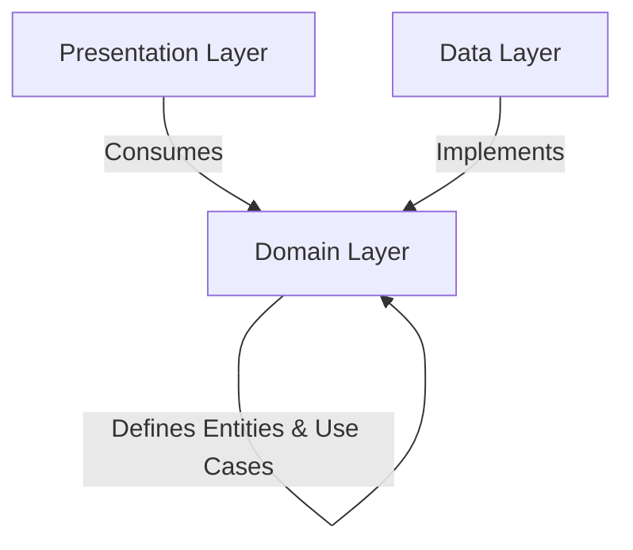

# Jatayat (যাতায়াত) 🚌

[](https://flutter.dev)
[](https://riverpod.dev)
[](https://pub.dev/packages/sqflite)
[](https://supabase.com)
[](#)

**Jatayat** is a premium, high-performance transit helper utility mobile application designed for commuters in Dhaka City. It simplifies urban transport navigation by matching routes and displaying official bus fares sourced accurately from public **Bangladesh Road Transport Authority (BRTA)** gazettes.

---

## ✨ Core Features

*   🔍 **High-Performance Fare Finder**: Select a starting stoppage and a destination, and let the app instantly compute your route, distance, official base rates, minimum fares, and maximum ticket prices.
*   🗺️ **Interactive Route Explorer**: View bus stoppages on a responsive, gorgeous vertical timeline. Easily filter through hundreds of routes by code (e.g., A-101, A-132) or name in real-time.
*   📑 **BRTA Gazette Proof Viewer**: Transparency at its core. Open the actual scanned official BRTA gazette PDF within the app, scrolled automatically to the exact page corresponding to the fare! Includes a robust local disk caching mechanism to avoid redundant downloads.
*   💾 **Offline-First SQLite Bookmarks**: Save routes or specific fare calculations to access them 100% offline. The system automatically caches associated bus routes so details pages and timeline stoppages continue loading smoothly without internet access.
*   🌐 **Dual Localization**: Complete native experience in both **English** and **Bengali (বাংলা)**, easily toggleable within settings.
*   🎨 **Rich Premium UI/UX**: Outfitted with professional glassmorphic details, beautiful micro-interactions, responsive list views, soft empty states, and standard light/dark modes.

---

## 🏗️ Clean Architecture Specification

Jatayat is engineered from the ground up using **Clean Architecture** patterns, ensuring a codebase that is highly modular, readable, and fully unit-testable.



### 📂 Feature Directory Structure
Every feature (e.g. `bookmarks`, `fare_finder`, `route_explorer`, `documents`) follows this strict layer separation:

*   **`domain/` (Core Business Rules)**:
    *   `entities/`: Pure Dart models with zero external package dependencies.
    *   `repositories/`: Abstract repository interfaces defining contracts.
    *   `usecases/`: Granular business actions (single responsibility principle, callable classes).
*   **`data/` (Infrastructure & Source Orchestration)**:
    *   `datasources/`: Connects directly to external API engines (Supabase, SQLite, SharedPreferences).
    *   `models/`: Handles serialization (`fromJson`, `toJson`) and type serialization mappings.
    *   `repositories/`: Concrete implementations of domain repository contracts.
*   **`presentation/` (Interactive Interfaces)**:
    *   `providers/`: Reactive state controllers using Riverpod (`AsyncNotifierProvider`, `FutureProvider`).
    *   `screens/`: UI templates and layouts.
    *   `widgets/`: Focused, reusable UI subcomponents.

---

## 🛠️ Technology Stack

*   **Framework**: [Flutter](https://flutter.dev) (Dart SDK `^3.11.1`)
*   **State Management**: [Riverpod](https://pub.dev/packages/flutter_riverpod) (`^2.6.1`)
*   **Local Database**: [Sqflite](https://pub.dev/packages/sqflite) (`^2.3.0`) & SQLite
*   **Remote Backend**: [Supabase Flutter](https://pub.dev/packages/supabase_flutter) (`^2.8.2`)
*   **Navigation**: [GoRouter](https://pub.dev/packages/go_router) (`^14.7.2`)
*   **Functional Programming**: [Dartz](https://pub.dev/packages/dartz) (`^0.10.1`)
*   **UI Components**: [Google Fonts](https://pub.dev/packages/google_fonts), [Shimmer](https://pub.dev/packages/shimmer), [Flutter Svg](https://pub.dev/packages/flutter_svg)

---

## 🚀 Getting Started

Follow these steps to set up and run the project locally.

### Prerequisites
*   [Flutter SDK](https://docs.flutter.dev/get-started/install) (`>= 3.11.1`)
*   [Dart SDK](https://dart.dev/get-started)
*   Android Studio / Xcode (for emulation)

### Setup & Run
1.  **Clone the Repository**:
    ```bash
    git clone https://github.com/your-username/jatayat.git
    cd jatayat
    ```

2.  **Environment Setup**:
    Create a `.env` file in the root directory and specify your Supabase credentials:
    ```env
    SUPABASE_URL=https://your-supabase-url.supabase.co
    SUPABASE_ANON_KEY=your-supabase-anon-key
    ```

3.  **Fetch Dependencies**:
    ```bash
    flutter pub get
    ```

4.  **Run Code Generators**:
    Jatayat uses code generators for JSON models and Freezed annotations:
    ```bash
    dart run build_runner build --delete-conflicting-outputs
    ```

5.  **Run App**:
    ```bash
    flutter run
    ```

---

## 📝 Localization & Translation

All static text strings are internationalized using standard Flutter `.arb` resource files under `lib/l10n/`:
- **`app_en.arb`** (English Translation dictionary)
- **`app_bn.arb`** (Bengali/বাংলা Translation dictionary)

To regenerate localizations automatically when making updates, run:
```bash
flutter gen-l10n
```
